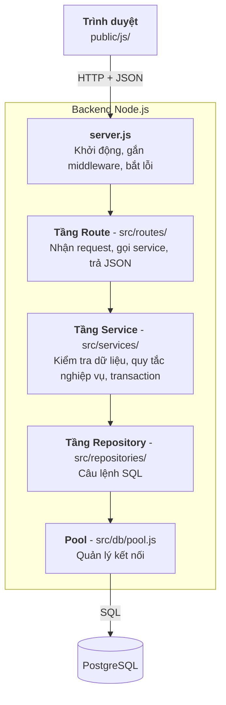
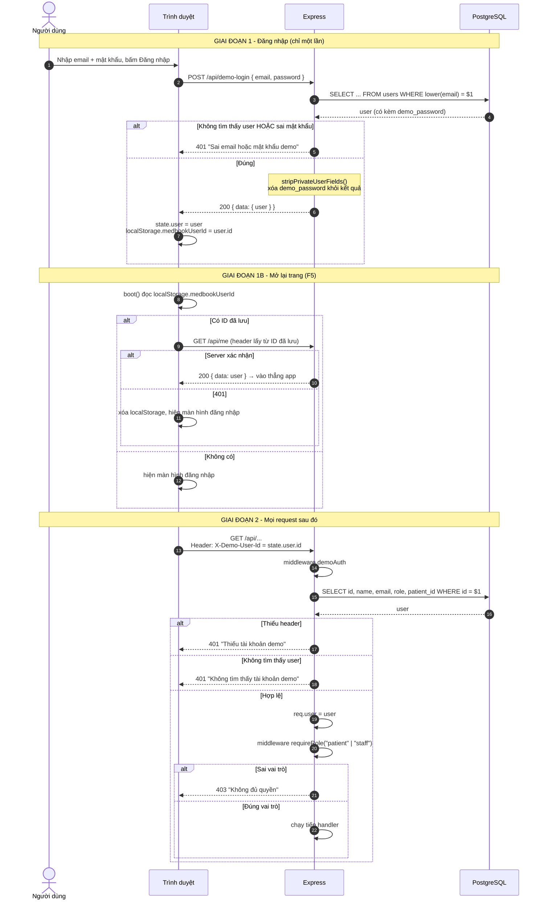
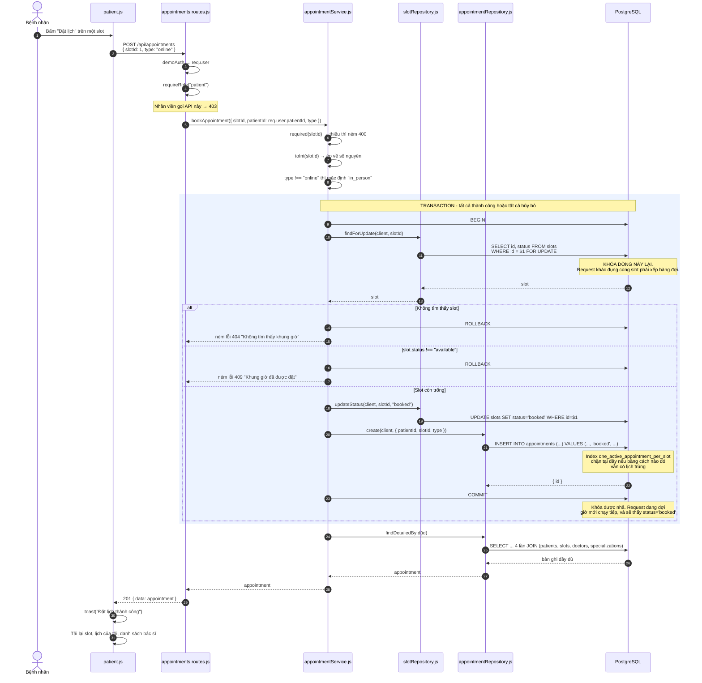
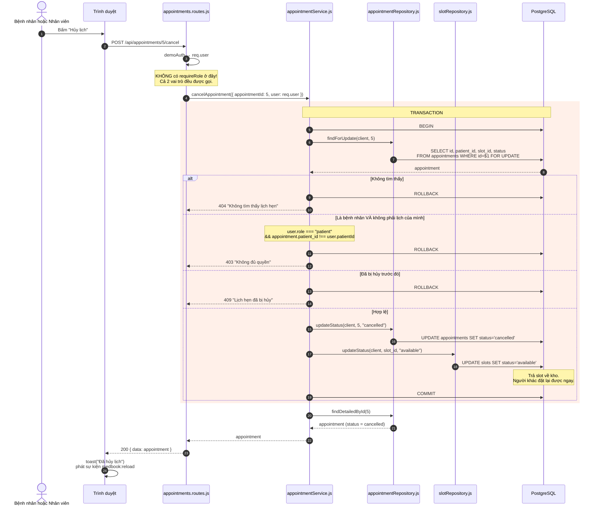
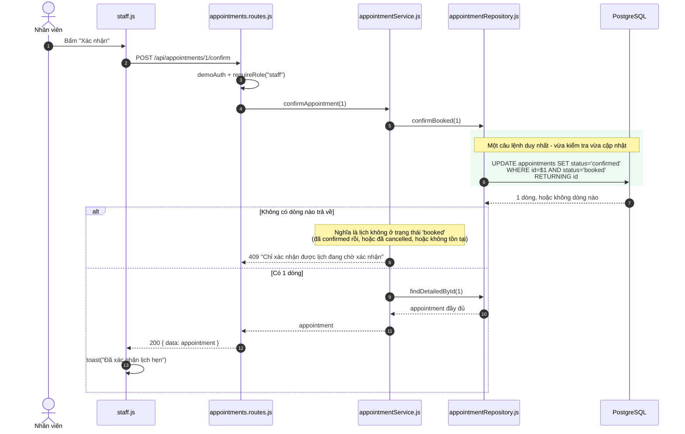
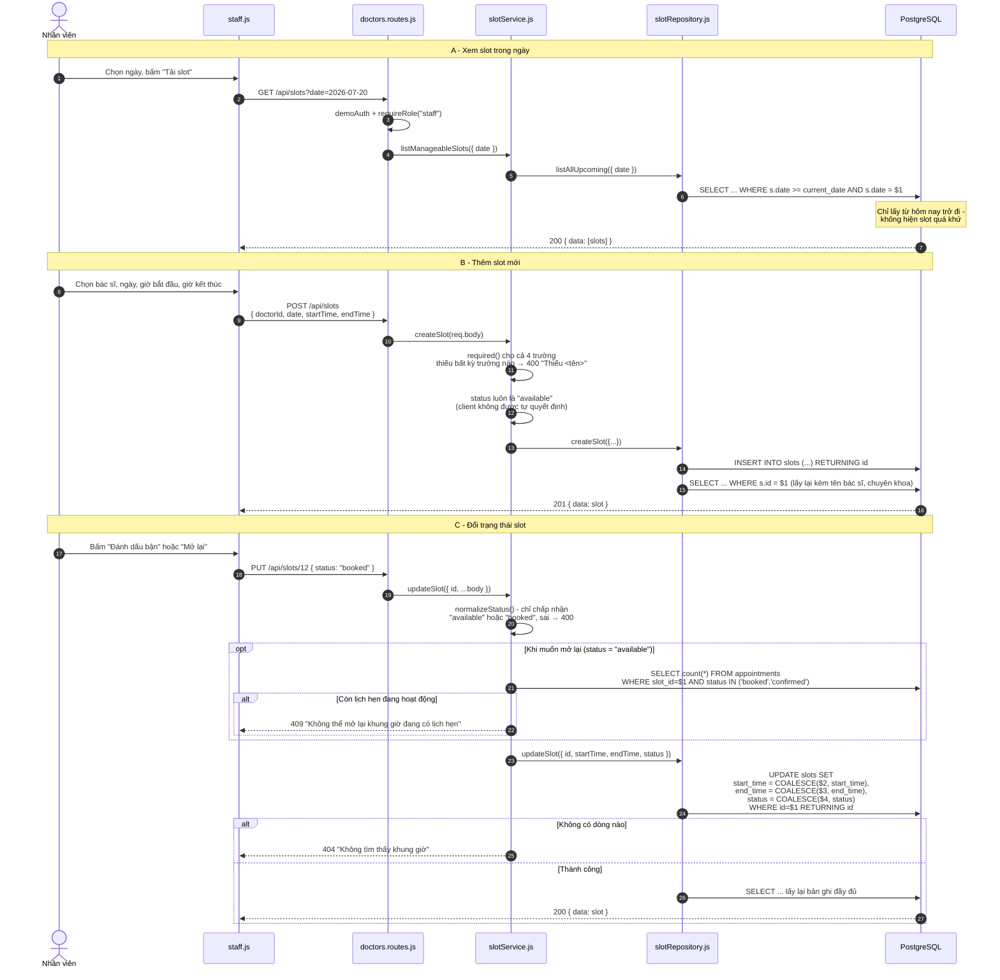
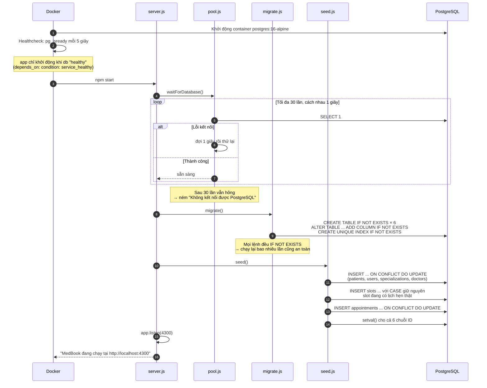
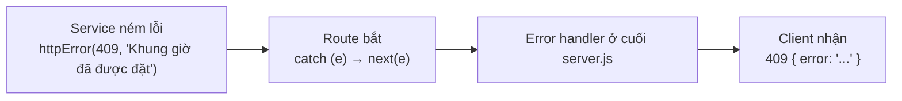

# MedBook - Luồng xử lý Backend

Tài liệu này giải thích **một request đi từ trình duyệt tới database rồi quay về như thế nào**, kèm sơ đồ tuần tự (sequence diagram) cho từng luồng nghiệp vụ.

Đọc kèm:

- [data-model.md](./data-model.md) - cấu trúc bảng và vòng đời trạng thái
- [prod.md](./prod.md) - quy tắc nghiệp vụ
- [adr/](./adr/) - lý do các quyết định thiết kế

---

## 1. Kiến trúc phân lớp

Backend chia 4 tầng. Mỗi tầng chỉ được gọi tầng ngay dưới nó, **không được nhảy cóc**.



### Mỗi tầng làm gì, không làm gì

| Tầng | **Được phép** | **Không được phép** |
| --- | --- | --- |
| **Route** | Đọc `req.query`, `req.body`, `req.params`. Gọi 1 hàm service. Trả `res.json()`. Chuyển lỗi bằng `next(error)` | Viết SQL. Chứa logic nghiệp vụ |
| **Service** | Kiểm tra đầu vào, áp quy tắc nghiệp vụ, mở transaction, ném lỗi kèm mã HTTP | Đụng vào `req` / `res`. Viết SQL trực tiếp |
| **Repository** | Viết SQL, ánh xạ tên cột `snake_case` → `camelCase` | Chứa quy tắc nghiệp vụ, ném lỗi HTTP |
| **Pool** | Mở/đóng kết nối, đợi database sẵn sàng | Mọi thứ khác |

Vì sao phải nghiêm ngặt? Vì khi cần sửa một quy tắc nghiệp vụ, bạn biết chắc phải mở file nào - không phải đi tìm khắp nơi.

### Ví dụ soi một request đơn giản

`GET /api/specializations` - lấy danh sách chuyên khoa:

```
doctors.routes.js:16   router.get("/specializations", demoAuth, handler)
                              ↓
doctorRepository.js:4  query("select id, name from specializations order by name")
                              ↓
pool.js:8              pool.query(sql) → trả về result.rows
                              ↓
                       res.json({ data: [...] })
```

Luồng này không có tầng Service vì **không có quy tắc nghiệp vụ nào** - chỉ đọc dữ liệu thuần. Route gọi thẳng Repository là hợp lý, thêm service rỗng chỉ tốn file.

### Quy ước chung của mọi API

| Quy ước | Chi tiết |
| --- | --- |
| Tiền tố | Mọi API bắt đầu bằng `/api` |
| Thành công | `{ "data": ... }` - dữ liệu luôn bọc trong khóa `data` |
| Thất bại | `{ "error": "Thông báo tiếng Việt" }` |
| Xác thực | Header `X-Demo-User-Id: <id>` (trừ `/health`, `/api/demo-users`, `/api/demo-login`) |
| Tên trường | Client nhận `camelCase` (`startTime`), database dùng `snake_case` (`start_time`). Repository chịu trách nhiệm đổi bằng `AS "startTime"` |

---

## 2. Cách xác thực hoạt động

Đây là **auth demo**, không phải auth thật. Xem [ADR-002](./adr/002-demo-auth.md) để biết lý do.



### Điểm cần hiểu rõ

**Không có token, không có session.** Sau khi đăng nhập, backend không nhớ gì cả. Mỗi request client tự khai báo "tôi là user số 3" qua header, và backend tin ngay.

**`localStorage` chỉ là gợi ý, không phải bằng chứng.** Khi mở lại trang, frontend lấy ID đã lưu để gọi `GET /api/me` - danh tính thật luôn đến từ phản hồi của server. Nếu tài khoản không còn tồn tại, API trả 401 và phiên bị dọn sạch. Frontend không bao giờ tin thẳng dữ liệu trong `localStorage`.

Điều này có nghĩa: **bất kỳ ai cũng có thể giả mạo** bằng cách đổi header thành `X-Demo-User-Id: 2` để thành nhân viên. Đây là điểm yếu **cố ý chấp nhận** - mục tiêu của demo là minh họa cơ chế phân quyền theo vai trò (RBAC), không phải bảo mật thật.

**Hai middleware, hai nhiệm vụ khác nhau:**

| Middleware | File | Câu hỏi trả lời | Lỗi trả về |
| --- | --- | --- | --- |
| `demoAuth` | `src/middleware/demoAuth.js` | "Bạn là ai?" (Authentication) | `401` |
| `requireRole` | `src/middleware/requireRole.js` | "Bạn có được làm việc này không?" (Authorization) | `403` |

Thứ tự bắt buộc: `demoAuth` chạy trước để tạo `req.user`, rồi `requireRole` mới đọc được `req.user.role`.

---

## 3. Luồng 1 - Bệnh nhân đặt lịch

Đây là luồng phức tạp nhất và cũng quan trọng nhất.



### Vì sao cần transaction ở đây?

Đặt lịch gồm **hai thao tác ghi**:

1. `UPDATE slots SET status = 'booked'`
2. `INSERT INTO appointments`

Nếu bước 1 xong mà bước 2 lỗi (mất kết nối, hết bộ nhớ...), ta sẽ có một slot bị khóa `booked` **mà không có lịch hẹn nào** - slot chết, không ai đặt được, cũng không ai hủy được.

`BEGIN ... COMMIT` đảm bảo: hoặc cả hai cùng thành công, hoặc cả hai cùng bị hủy bỏ. Không có trạng thái nửa vời.

### Vì sao cần `FOR UPDATE`?

Kịch bản kinh điển: **An và Linh cùng bấm đặt slot #1 trong cùng một giây.**

Nếu **không** có `FOR UPDATE`:

| Thời điểm | Request của An | Request của Linh |
| --- | --- | --- |
| t1 | Đọc slot #1 → `available` ✓ | |
| t2 | | Đọc slot #1 → `available` ✓ (chưa ai ghi) |
| t3 | Ghi `booked` + tạo lịch | |
| t4 | | Ghi `booked` + tạo lịch |

→ **Hai lịch hẹn trên cùng một slot.** Bệnh nhân tới phòng khám cùng giờ, bác sĩ không biết tiếp ai.

Có `FOR UPDATE`:

| Thời điểm | Request của An | Request của Linh |
| --- | --- | --- |
| t1 | Đọc + **khóa** slot #1 → `available` ✓ | |
| t2 | | Muốn đọc slot #1 → **bị chặn, phải đợi** |
| t3 | Ghi `booked`, `COMMIT`, nhả khóa | ...vẫn đang đợi... |
| t4 | | Đọc được → thấy `booked` → trả 409 ✓ |

Linh nhận thông báo "Khung giờ đã được đặt" - đúng như mong đợi.

Đây là kỹ thuật **pessimistic locking** (khóa bi quan): giả định sẽ có tranh chấp nên khóa trước cho chắc. Xem [ADR-004](./adr/004-transaction-lock-booking.md).

### Ba lớp bảo vệ chống đặt trùng

| Lớp | Nằm ở đâu | Chặn được gì |
| --- | --- | --- |
| 1. Kiểm tra `status !== "available"` | `appointmentService.js` | Trường hợp thông thường, trả lỗi 409 đẹp |
| 2. `SELECT ... FOR UPDATE` | `slotRepository.findForUpdate()` | Hai request đồng thời |
| 3. Partial unique index | Database | Mọi đường đi khác: script chạy tay, code mới viết sai |

Càng xuống sâu càng khó vượt qua, nhưng thông báo lỗi càng xấu. Lớp 1 cho lỗi thân thiện, lớp 3 cho lỗi 500 nhưng dữ liệu tuyệt đối an toàn.

### Ranh giới transaction

Cả `bookAppointment()` và `cancelAppointment()` đều theo đúng một khuôn:

```js
// 1. Kiểm tra đầu vào TRƯỚC khi mượn kết nối từ pool
const normalizedSlotId = toInt(required(slotId, "slotId"));

const client = await getClient();
let appointmentId;
try {
  await client.query("begin");
  // ... chỉ những thao tác thật sự cần nguyên tử
  await client.query("commit");
  appointmentId = appointment.id;
} catch (error) {
  await client.query("rollback");
  throw error;
} finally {
  client.release();
}

// 2. Đọc lại dữ liệu SAU khi transaction đã đóng hẳn
return appointmentRepository.findDetailedById(appointmentId);
```

Hai điều quan trọng:

- **Kiểm tra đầu vào nằm ngoài transaction.** Request thiếu `slotId` bị chặn ngay, không tốn một kết nối từ pool.
- **Đọc lại dữ liệu cũng nằm ngoài transaction.** Trước đây `findDetailedById()` nằm trong khối `try`, nên nếu nó lỗi thì `catch` sẽ gọi `ROLLBACK` cho một transaction **đã COMMIT** - không phá dữ liệu nhưng sai về logic. Nay chỉ những gì thật sự cần nguyên tử mới nằm trong `try`.

---

## 4. Luồng 2 - Hủy lịch

Điểm đặc biệt: **cùng một API cho cả bệnh nhân và nhân viên**, quyền được kiểm tra bên trong service chứ không phải ở route.



### Vì sao kiểm tra quyền nằm ở service, không ở route?

Vì quy tắc không đơn giản là "vai trò nào được vào". Quy tắc thật là:

> Nhân viên hủy được **mọi** lịch. Bệnh nhân chỉ hủy được lịch **của chính mình**.

Middleware `requireRole` chỉ biết vai trò, **không biết lịch số 5 là của ai** - muốn biết phải truy vấn database. Nên logic này bắt buộc phải nằm ở service, nơi đã có dữ liệu trong tay.

Đây là phân biệt kinh điển giữa hai loại phân quyền:

| Loại | Ví dụ | Đặt ở đâu |
| --- | --- | --- |
| Theo vai trò (RBAC) | "Chỉ nhân viên vào được `/api/slots`" | Middleware |
| Theo quyền sở hữu | "Bệnh nhân chỉ hủy lịch của mình" | Service (cần đọc DB) |

### Vì sao hủy lịch cũng cần transaction?

Cũng hai thao tác ghi: đổi trạng thái lịch + trả slot về `available`. Nếu chỉ chạy được một nửa:

- Lịch đã `cancelled` nhưng slot vẫn `booked` → slot chết, vĩnh viễn không ai đặt được.
- Slot đã `available` nhưng lịch vẫn `booked` → người khác đặt vào, thành hai lịch trùng.

---

## 5. Luồng 3 - Nhân viên xác nhận lịch

Luồng đơn giản nhất, nhưng dùng một kỹ thuật hay.



### Vì sao KHÔNG cần transaction ở đây?

Vì chỉ có **một** thao tác ghi. Một câu `UPDATE` trong PostgreSQL vốn đã nguyên tử - không cần bọc thêm.

### Kỹ thuật "cập nhật có điều kiện"

So sánh hai cách viết:

**Cách ngây thơ (có lỗ hổng):**

```js
const appt = await findById(id);              // đọc
if (appt.status !== "booked") throw 409;      // kiểm tra
await update(id, "confirmed");                // ghi
```

Giữa lúc *đọc* và lúc *ghi* có một khe hở. Nếu trong khe đó bệnh nhân hủy lịch, ta sẽ xác nhận một lịch đã bị hủy.

**Cách đang dùng (an toàn):**

```sql
UPDATE appointments SET status='confirmed'
WHERE id = $1 AND status = 'booked'
RETURNING id
```

Kiểm tra và ghi gộp làm một, database tự khóa dòng trong lúc thực thi. Không có khe hở nào. Không trả về dòng nào = điều kiện không thỏa = ném 409.

Kỹ thuật này gọi là **conditional update** hoặc **compare-and-set**. Nên ưu tiên dùng bất cứ khi nào chỉ cần đổi trạng thái một dòng.

---

## 6. Luồng 4 - Nhân viên quản lý slot



### Mẹo `COALESCE` cho cập nhật từng phần

```sql
SET start_time = COALESCE($2, start_time)
```

`COALESCE(a, b)` trả về `a` nếu `a` khác NULL, ngược lại trả `b`. Áp dụng vào đây:

- Client gửi `startTime` → cột được cập nhật.
- Client **không** gửi `startTime` (tham số là `NULL`) → cột giữ nguyên giá trị cũ.

Nhờ vậy chỉ cần **một** câu SQL phục vụ mọi kiểu cập nhật từng phần, không phải ghép chuỗi SQL động rối rắm.

### Vì sao phải kiểm tra trước khi mở lại slot

Trước đây `slotService.updateSlot()` không đụng tới bảng `appointments`. Nhân viên bấm "Mở lại" một slot đang có lịch hẹn thật sẽ khiến `slots.status = 'available'` trong khi lịch hẹn vẫn `booked`. Người tiếp theo đặt vào slot đó sẽ bị partial unique index chặn ở tầng database → API trả **500** khó hiểu.

Nay service đếm số lịch hẹn đang hoạt động trước khi cho mở lại:

```js
if (normalizedStatus === "available") {
  const active = await appointmentRepository.countActiveBySlot(slotId);
  if (active > 0) {
    throw httpError(409, "Không thể mở lại khung giờ đang có lịch hẹn");
  }
}
```

Nhân viên muốn giải phóng slot thì phải **hủy lịch hẹn** - và luồng hủy lịch tự trả slot về `available`. Đúng trình tự nghiệp vụ, không có đường tắt gây lệch dữ liệu.

Chiều ngược lại (`available` → `booked`) vẫn cho phép tự do, vì đó là cách nhân viên chặn khung giờ khi bác sĩ bận. Xem [ADR-003](./adr/003-slot-status-denormalized.md).

---

## 7. Luồng khởi động ứng dụng

Điều gì xảy ra khi chạy `docker compose up`?



### Hai lớp chờ database, vì sao?

| Lớp | Cơ chế | Bảo vệ điều gì |
| --- | --- | --- |
| Docker | `healthcheck` + `depends_on: service_healthy` | Container app không khởi động trước khi container db sẵn sàng |
| Ứng dụng | `waitForDatabase()` thử 30 lần | Chạy `npm start` ngoài Docker, hoặc db khởi động lại giữa chừng |

Lớp thứ hai quan trọng vì không phải lúc nào cũng chạy trong Docker - khi phát triển hoặc chạy CI, cách khởi động khác nhau.

### Vì sao migrate và seed chạy tự động mỗi lần khởi động?

Đây là lựa chọn **chỉ hợp lý cho demo**: người dùng gõ một lệnh `docker compose up` là có ngay app với dữ liệu đầy đủ, không cần bước cài đặt thủ công.

Hệ thống thật **không được** làm vậy - migrate phải là một bước riêng, có kiểm soát, chạy trước khi triển khai. Xem [ADR-005](./adr/005-migration-strategy.md).

---

## 8. Cách xử lý lỗi

### Đường đi của một lỗi



Toàn bộ việc bắt lỗi gói gọn trong 5 dòng ở `server.js`:

```js
app.use((error, req, res, _next) => {
  const status = error.statusCode || 500;
  if (status >= 500) console.error(error);
  res.status(status).json({ error: error.message || "Lỗi máy chủ" });
});
```

Kèm hàm trợ giúp ở `src/errors.js`:

```js
function httpError(statusCode, message) {
  const error = new Error(message);
  error.statusCode = statusCode;   // ← chỉ cần gắn thêm thuộc tính này
  return error;
}
```

### Vì sao cách này gọn?

Mọi route đều viết theo đúng một khuôn:

```js
router.post("/...", demoAuth, requireRole("staff"), async (req, res, next) => {
  try {
    res.json({ data: await service.doSomething(...) });
  } catch (error) {
    next(error);   // đẩy lên error handler, không tự xử lý
  }
});
```

Không route nào phải tự quyết định mã HTTP hay định dạng lỗi. Service ném lỗi kèm mã, phần còn lại tự động.

### Chỉ ghi log lỗi 500

```js
if (status >= 500) console.error(error);
```

Lỗi 4xx là **lỗi của người dùng** (nhập thiếu, sai quyền, đặt slot đã có người) - chuyện bình thường, ghi log chỉ làm nhiễu. Lỗi 5xx là **lỗi của hệ thống** - cần in đầy đủ stack trace để lập trình viên điều tra.

### Bảng mã lỗi đầy đủ

| Mã | Khi nào | Thông báo mẫu | Ném ở đâu |
| --- | --- | --- | --- |
| `400` | Thiếu trường bắt buộc | `Thiếu slotId`, `Thiếu doctorId` | `required()` trong service |
| `400` | Giá trị không hợp lệ | `Trạng thái slot không hợp lệ` | `normalizeStatus()` |
| `400` | Đăng nhập thiếu thông tin | `Vui lòng nhập email và mật khẩu` | `authService.login()` |
| `401` | Thiếu header xác thực | `Thiếu tài khoản demo` | `authService.authenticateByHeader()` |
| `401` | Header sai định dạng | `Tài khoản demo không hợp lệ` | nt |
| `401` | User không tồn tại | `Không tìm thấy tài khoản demo` | nt |
| `401` | Sai email/mật khẩu | `Sai email hoặc mật khẩu demo` | `authService.login()` |
| `403` | Sai vai trò | `Không đủ quyền` | `requireRole` middleware |
| `403` | Hủy lịch người khác | `Không đủ quyền` | `appointmentService.cancelAppointment()` |
| `404` | Slot không tồn tại | `Không tìm thấy khung giờ` | `appointmentService`, `slotService` |
| `404` | Lịch hẹn không tồn tại | `Không tìm thấy lịch hẹn` | `appointmentService.cancelAppointment()` |
| `404` | API không tồn tại | `Không tìm thấy API` | catch-all trong `server.js` |
| `409` | Slot đã có người đặt | `Khung giờ đã được đặt` | `appointmentService.bookAppointment()` |
| `409` | Lịch đã bị hủy | `Lịch hẹn đã bị hủy` | `appointmentService.cancelAppointment()` |
| `409` | Không xác nhận được | `Chỉ xác nhận được lịch đang chờ xác nhận` | `appointmentService.confirmAppointment()` |
| `409` | Mở lại slot đang có lịch | `Không thể mở lại khung giờ đang có lịch hẹn` | `slotService.updateSlot()` |
| `500` | Ngoài dự kiến | `Lỗi máy chủ` hoặc thông báo gốc | Error handler |

---

## 9. Bảng tra cứu: API nào, ai gọi được, đi qua tầng nào

| Method | Đường dẫn | Vai trò | Route → Service → Repository |
| --- | --- | --- | --- |
| `GET` | `/health` | công khai | `server.js` → `pool.query("select 1")` |
| `GET` | `/api/demo-users` | công khai | `auth.routes` → `authService` → `userRepository` |
| `POST` | `/api/demo-login` | công khai | `auth.routes` → `authService` → `userRepository` |
| `GET` | `/api/me` | đã đăng nhập | `auth.routes` (trả thẳng `req.user`) |
| `GET` | `/api/specializations` | đã đăng nhập | `doctors.routes` → `doctorRepository` |
| `GET` | `/api/doctors` | đã đăng nhập | `doctors.routes` → `doctorRepository` |
| `GET` | `/api/doctors/:id/slots` | đã đăng nhập | `doctors.routes` → `slotRepository` |
| `GET` | `/api/slots/available` | đã đăng nhập | `doctors.routes` → `slotRepository` |
| `GET` | `/api/slots` | **staff** | `doctors.routes` → `slotService` → `slotRepository` |
| `POST` | `/api/slots` | **staff** | `doctors.routes` → `slotService` → `slotRepository` |
| `PUT` | `/api/slots/:id` | **staff** | `doctors.routes` → `slotService` → `slotRepository` |
| `POST` | `/api/appointments` | **patient** | `appointments.routes` → `appointmentService` → 2 repository |
| `GET` | `/api/my-appointments` | **patient** | `appointments.routes` → `appointmentService` → `appointmentRepository` |
| `GET` | `/api/appointments` | **staff** | `appointments.routes` → `appointmentService` → `appointmentRepository` |
| `POST` | `/api/appointments/:id/confirm` | **staff** | `appointments.routes` → `appointmentService` → `appointmentRepository` |
| `POST` | `/api/appointments/:id/cancel` | **cả hai** | `appointments.routes` → `appointmentService` → 2 repository |

Ghi chú: các API tra cứu đơn giản (chuyên khoa, bác sĩ, slot còn trống) đi thẳng từ Route xuống Repository, bỏ qua tầng Service vì không có quy tắc nghiệp vụ nào cần áp dụng.

---

## 10. Ba luồng dùng transaction, ba luồng không

| Luồng | Có transaction? | Lý do |
| --- | --- | --- |
| Đặt lịch | **Có** + `FOR UPDATE` | 2 thao tác ghi, có nguy cơ đặt trùng |
| Hủy lịch | **Có** + `FOR UPDATE` | 2 thao tác ghi, cần kiểm tra quyền trước khi ghi |
| Xác nhận lịch | Không | 1 thao tác ghi, dùng cập nhật có điều kiện |
| Tạo slot | Không | 1 thao tác ghi (`INSERT`), không tranh chấp |
| Sửa slot | Không | 1 thao tác ghi (`UPDATE`) |
| Mọi API đọc | Không | Chỉ đọc |

**Quy tắc rút ra:** cần transaction khi có **từ 2 thao tác ghi trở lên phải cùng thành công hoặc cùng thất bại**. Một thao tác ghi đơn lẻ đã tự nguyên tử.

Và cần thêm `FOR UPDATE` khi phải **đọc trước rồi mới quyết định ghi** - vì giữa đọc và ghi luôn có khe hở cho request khác chen vào.
