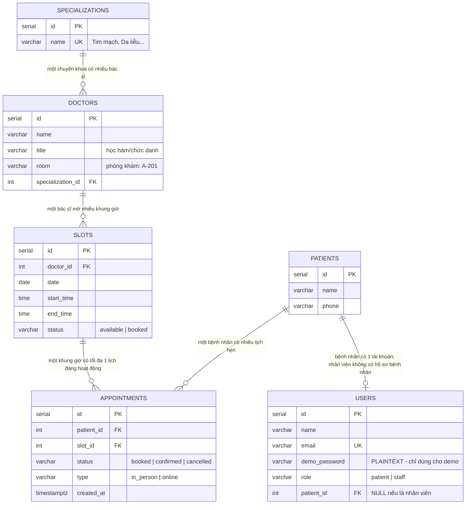
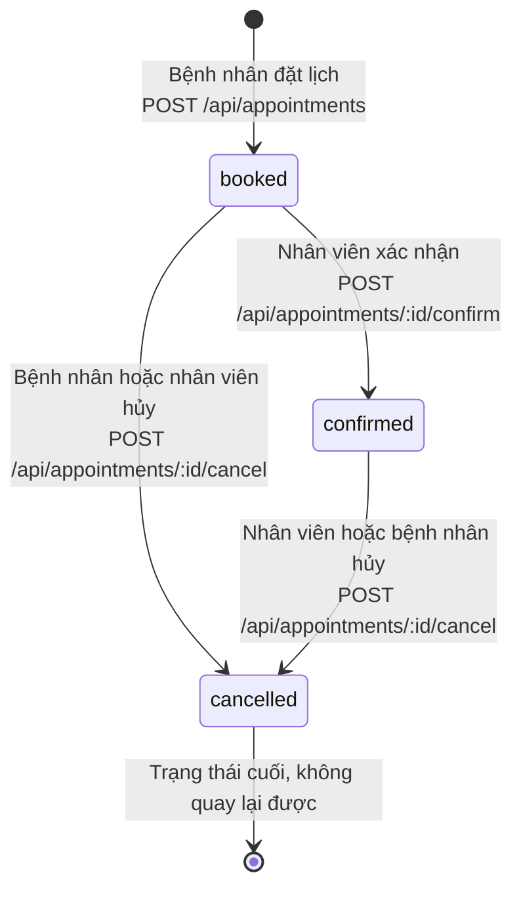
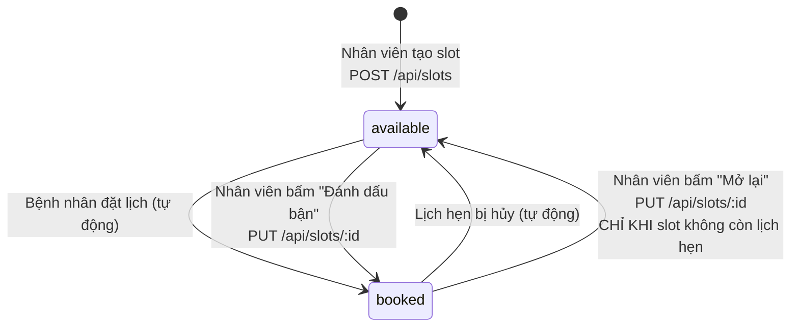

# MedBook - Mô hình dữ liệu

Tài liệu này mô tả **toàn bộ cấu trúc database** của MedBook: có những bảng nào, mỗi cột nghĩa là gì, các bảng nối với nhau ra sao, và dữ liệu được phép chuyển trạng thái như thế nào.

Nguồn sự thật là `src/db/migrate.js`. Nếu file đó thay đổi, tài liệu này phải cập nhật theo.

Xem thêm:

- [prod.md](./prod.md) - phạm vi sản phẩm và quy tắc nghiệp vụ
- [backend-flows.md](./backend-flows.md) - luồng xử lý request
- [adr/](./adr/) - lý do đằng sau các quyết định thiết kế

---

## 1. Bức tranh tổng thể

MedBook có **6 bảng**. Có thể chia thành 3 nhóm:

| Nhóm | Bảng | Bản chất |
| --- | --- | --- |
| **Danh mục** (ít thay đổi) | `specializations`, `doctors` | Dữ liệu tham chiếu, bệnh viện khai báo một lần |
| **Con người** | `patients`, `users` | Ai là ai, ai đăng nhập được |
| **Nghiệp vụ** (thay đổi liên tục) | `slots`, `appointments` | Trái tim của app - lịch làm việc và lịch hẹn |

Cách hiểu nhanh nhất bằng một câu:

> Một **bác sĩ** thuộc một **chuyên khoa**, mở ra nhiều **slot** (khung giờ trống). Một **bệnh nhân** đặt một **appointment** vào một slot. **User** là tài khoản đăng nhập, có thể là bệnh nhân hoặc nhân viên.

---

## 2. Sơ đồ quan hệ (ERD)



### Ba quan hệ dễ nhầm, giải thích kỹ

**a) `users` và `patients` là hai bảng khác nhau**

Nhiều người tưởng đây là một. Không phải:

- `patients` = **hồ sơ y tế** (tên, số điện thoại để bệnh viện liên hệ).
- `users` = **tài khoản đăng nhập** (email, mật khẩu, vai trò).

Vì sao tách? Vì nhân viên bệnh viện *có tài khoản* nhưng *không phải bệnh nhân*. Cột `users.patient_id` vì thế **được phép NULL**:

| User | `role` | `patient_id` | Ý nghĩa |
| --- | --- | --- | --- |
| Nguyễn Minh An | `patient` | `1` | Trỏ tới hồ sơ bệnh nhân số 1 |
| Điều phối viên Mai | `staff` | `NULL` | Nhân viên, không có hồ sơ bệnh nhân |

Hệ quả trong code: mọi API dành cho bệnh nhân đều dùng `req.user.patientId`, còn API cho nhân viên thì không bao giờ đụng tới nó.

**b) `appointments` trỏ tới `slot`, không trỏ trực tiếp tới `doctor`**

Muốn biết lịch hẹn này của bác sĩ nào, phải đi vòng: `appointments → slots → doctors`. Điều này giải thích vì sao mọi câu SQL trong `appointmentRepository.js` đều có 4 lệnh `JOIN`.

Lợi ích: không lưu trùng thông tin. Nếu lưu cả `doctor_id` trong `appointments`, sẽ có nguy cơ nó khác với `slots.doctor_id` - dữ liệu mâu thuẫn.

**c) Một slot có nhiều dòng `appointments` nhưng chỉ một dòng "đang hoạt động"**

Quan hệ vẽ là một-nhiều (`||--o{`), nghe có vẻ mâu thuẫn với quy tắc "một slot chỉ có một lịch". Thực tế:

```
Slot #2  ─┬─ Appointment #1  status = cancelled   (lịch cũ, đã hủy)
          ├─ Appointment #5  status = cancelled   (lịch cũ, đã hủy)
          └─ Appointment #9  status = booked      ← chỉ MỘT dòng đang hoạt động
```

Lịch đã hủy vẫn nằm lại trong bảng để lưu lịch sử. Ràng buộc "chỉ một lịch hoạt động" được đảm bảo bằng một **unique index có điều kiện** - xem mục 4.

---

## 3. Từ điển dữ liệu (Data Dictionary)

Ký hiệu: **PK** = khóa chính, **FK** = khóa ngoại, **UK** = giá trị duy nhất.

### 3.1. Bảng `patients` - Hồ sơ bệnh nhân

| Cột | Kiểu | NULL? | Mặc định | Khóa | Ý nghĩa |
| --- | --- | --- | --- | --- | --- |
| `id` | `serial` | Không | tự tăng | PK | Mã bệnh nhân |
| `name` | `varchar(150)` | Không | - | | Họ tên đầy đủ |
| `phone` | `varchar(30)` | Không | - | | Số điện thoại liên hệ. Hiển thị cho nhân viên để gọi xác nhận |

Bảng đơn giản nhất. Trong hệ thống thật sẽ còn ngày sinh, giới tính, mã bảo hiểm, địa chỉ - demo cố tình bỏ.

### 3.2. Bảng `users` - Tài khoản đăng nhập

| Cột | Kiểu | NULL? | Mặc định | Khóa | Ý nghĩa |
| --- | --- | --- | --- | --- | --- |
| `id` | `serial` | Không | tự tăng | PK | Mã tài khoản. **Cũng là giá trị gửi trong header `X-Demo-User-Id`** |
| `name` | `varchar(150)` | Không | - | | Tên hiển thị trên giao diện |
| `email` | `varchar(150)` | Không | - | UK | Dùng để đăng nhập. Không cho phép trùng |
| `demo_password` | `varchar(80)` | Không | `'demo123'` | | **Mật khẩu lưu dạng chữ thường, không mã hóa.** Chỉ chấp nhận được vì đây là demo - xem [ADR-002](./adr/002-demo-auth.md) |
| `role` | `varchar(20)` | Không | - | | Vai trò. Chỉ nhận `patient` hoặc `staff` |
| `patient_id` | `integer` | **Có** | `NULL` | FK → `patients.id` | Hồ sơ bệnh nhân tương ứng. NULL với nhân viên |

**Ràng buộc:**

```sql
CHECK (role IN ('patient', 'staff'))
UNIQUE (email)
```

**Lưu ý bảo mật:** cột `demo_password` **không bao giờ được trả về client**. Việc lọc bỏ nằm ở hai chỗ:

- `userRepository.js` có sẵn hằng `publicUserColumns` không chứa cột này.
- `authService.stripPrivateUserFields()` xóa cột này khỏi kết quả đăng nhập.

### 3.3. Bảng `specializations` - Chuyên khoa

| Cột | Kiểu | NULL? | Mặc định | Khóa | Ý nghĩa |
| --- | --- | --- | --- | --- | --- |
| `id` | `serial` | Không | tự tăng | PK | Mã chuyên khoa |
| `name` | `varchar(120)` | Không | - | UK | Tên chuyên khoa. Ví dụ: `Tim mạch`, `Da liễu` |

Bảng tra cứu thuần túy. Dùng để lọc bác sĩ trên giao diện bệnh nhân.

### 3.4. Bảng `doctors` - Bác sĩ

| Cột | Kiểu | NULL? | Mặc định | Khóa | Ý nghĩa |
| --- | --- | --- | --- | --- | --- |
| `id` | `serial` | Không | tự tăng | PK | Mã bác sĩ |
| `name` | `varchar(150)` | Không | - | | Tên bác sĩ. Ví dụ: `BS. Phạm Mạnh Hùng` |
| `title` | `varchar(150)` | Không | - | | Chức danh hiển thị. Ví dụ: `Chuyên khoa Tim mạch` |
| `room` | `varchar(50)` | Không | - | | Phòng khám. Ví dụ: `A-201` |
| `specialization_id` | `integer` | Không | - | FK → `specializations.id` | Chuyên khoa của bác sĩ |

**Điểm cần biết:** một bác sĩ chỉ thuộc **một** chuyên khoa. Thực tế bác sĩ có thể đa khoa, nhưng demo giữ đơn giản.

Bác sĩ **không có tài khoản đăng nhập** trong phiên bản này - họ là dữ liệu, không phải người dùng.

### 3.5. Bảng `slots` - Khung giờ khám

Đây là bảng "lịch làm việc": mỗi dòng là một ô thời gian mà bác sĩ có thể tiếp một bệnh nhân.

| Cột | Kiểu | NULL? | Mặc định | Khóa | Ý nghĩa |
| --- | --- | --- | --- | --- | --- |
| `id` | `serial` | Không | tự tăng | PK | Mã khung giờ |
| `doctor_id` | `integer` | Không | - | FK → `doctors.id` | Khung giờ này của bác sĩ nào |
| `date` | `date` | Không | - | | Ngày khám. Chỉ ngày, không có giờ |
| `start_time` | `time` | Không | - | | Giờ bắt đầu. Ví dụ: `08:00` |
| `end_time` | `time` | Không | - | | Giờ kết thúc. Ví dụ: `08:30` |
| `status` | `varchar(20)` | Không | `'available'` | | `available` = còn trống, `booked` = đã có người/bận |

**Ràng buộc:**

```sql
CHECK (status IN ('available', 'booked'))
```

**Vì sao tách `date` và `time` riêng thay vì một cột `timestamp`?**

Vì hầu hết truy vấn của app là "lấy slot theo ngày" (`WHERE s.date = $1`). Tách ra thì câu SQL đọc dễ và so sánh trực tiếp với chuỗi `YYYY-MM-DD` từ input `<input type="date">` của giao diện. Đổi lại, phải tự lo múi giờ - demo mặc định coi mọi thứ là giờ địa phương của server.

**Cảnh báo:** cột `status` là dữ liệu *có thể suy ra được* từ bảng `appointments`. Đây là chủ ý (để truy vấn nhanh) nhưng có rủi ro lệch dữ liệu - xem [ADR-003](./adr/003-slot-status-denormalized.md).

### 3.6. Bảng `appointments` - Lịch hẹn

Bảng quan trọng nhất.

| Cột | Kiểu | NULL? | Mặc định | Khóa | Ý nghĩa |
| --- | --- | --- | --- | --- | --- |
| `id` | `serial` | Không | tự tăng | PK | Mã lịch hẹn |
| `patient_id` | `integer` | Không | - | FK → `patients.id` | Ai đặt lịch |
| `slot_id` | `integer` | Không | - | FK → `slots.id` | Đặt vào khung giờ nào |
| `status` | `varchar(20)` | Không | `'booked'` | | `booked` = chờ xác nhận, `confirmed` = đã xác nhận, `cancelled` = đã hủy |
| `type` | `varchar(20)` | Không | `'in_person'` | | `in_person` = khám trực tiếp, `online` = tư vấn từ xa |
| `created_at` | `timestamptz` | Không | `now()` | | Thời điểm đặt lịch. Dùng `timestamptz` nên có kèm múi giờ |

**Ràng buộc:**

```sql
CHECK (status IN ('booked', 'confirmed', 'cancelled'))
CHECK (type   IN ('in_person', 'online'))
```

Cộng thêm một unique index đặc biệt, giải thích ngay dưới đây.

---

## 4. Ràng buộc quan trọng nhất: chống đặt trùng

```sql
CREATE UNIQUE INDEX one_active_appointment_per_slot
  ON appointments(slot_id)
  WHERE status IN ('booked', 'confirmed');
```

Đây là kỹ thuật **partial unique index** (index duy nhất có điều kiện) của PostgreSQL. Dịch sang tiếng Việt:

> "Trong số các lịch hẹn **chưa bị hủy**, mỗi `slot_id` chỉ được xuất hiện đúng một lần."

### Vì sao phải có mệnh đề `WHERE`?

Nếu viết `UNIQUE(slot_id)` trơn, sẽ hỏng nghiệp vụ ngay:

| Kịch bản | Có `WHERE` | Không có `WHERE` |
| --- | --- | --- |
| An đặt slot #5, rồi hủy. Linh muốn đặt lại slot #5 | Được. Dòng của An đã `cancelled` nên không tính | **Bị chặn** - vì slot #5 đã tồn tại trong index |

Nói cách khác, mệnh đề `WHERE` cho phép **tái sử dụng slot sau khi hủy**, đúng như quy tắc nghiệp vụ.

### Đây là lớp bảo vệ thứ hai

Trong `appointmentService.bookAppointment()` đã có kiểm tra `if (slot.status !== "available") throw 409`. Vậy index này để làm gì?

Vì kiểm tra trong code **có thể bị bỏ qua**: ai đó viết một script chạy `INSERT` thẳng vào DB, hoặc một lập trình viên tương lai thêm một đường code mới mà quên kiểm tra. Index nằm ở tầng database nên **không ai vượt qua được**.

Nguyên tắc: *quy tắc nghiệp vụ sống còn thì đặt ở cả code lẫn database.*

---

## 5. Vòng đời dữ liệu (State Machine)

### 5.1. Vòng đời `appointments`



**Bảng chuyển trạng thái đầy đủ:**

| Từ | Sang | Ai được làm | API | Nếu vi phạm |
| --- | --- | --- | --- | --- |
| (mới) | `booked` | `patient` | `POST /api/appointments` | Slot không trống → `409` |
| `booked` | `confirmed` | `staff` | `POST /api/appointments/:id/confirm` | - |
| `booked` | `cancelled` | `patient` (lịch của mình), `staff` (mọi lịch) | `POST /api/appointments/:id/cancel` | Bệnh nhân hủy lịch người khác → `403` |
| `confirmed` | `cancelled` | `patient` (lịch của mình), `staff` | `POST /api/appointments/:id/cancel` | - |
| `confirmed` | `booked` | **Không ai** | - | Không có API |
| `cancelled` | bất kỳ | **Không ai** | - | Hủy lần nữa → `409` "Lịch hẹn đã bị hủy"<br/>Xác nhận lịch đã hủy → `409` |

**Ba điều cần nhớ:**

1. `cancelled` là **trạng thái chết** - vào rồi là ở lại vĩnh viễn. Muốn khám lại phải đặt lịch mới.
2. Chỉ nhân viên mới xác nhận được. Bệnh nhân không tự xác nhận lịch của mình.
3. Việc xác nhận được thực hiện bằng một câu SQL nguyên tử:
   ```sql
   UPDATE appointments SET status='confirmed'
   WHERE id = $1 AND status = 'booked' RETURNING id
   ```
   Nếu lịch không ở trạng thái `booked`, câu lệnh không trả về dòng nào và code ném lỗi `409`. Cách này an toàn hơn "đọc rồi mới ghi" vì không có khe hở thời gian.

### 5.2. Vòng đời `slots`



**Điểm mấu chốt: slot đổi trạng thái theo HAI con đường**

| Con đường | Ai kích hoạt | Xảy ra ở đâu trong code |
| --- | --- | --- |
| **Tự động** | Hệ thống, khi có người đặt hoặc hủy lịch | `appointmentService.js` gọi `slotRepository.updateStatus()` bên trong transaction |
| **Thủ công** | Nhân viên bấm nút trên giao diện | `slotService.updateSlot()` |

Đây từng là chỗ dữ liệu bị lệch:

> Slot #2 đang `booked` vì An đã đặt lịch. Nhân viên bấm "Mở lại" → slot thành `available`, nhưng lịch hẹn của An **vẫn còn** trong bảng `appointments`. Giờ Linh đặt được cùng slot đó, và `INSERT` bị partial unique index chặn → lỗi 500.

**Đã vá:** `slotService.updateSlot()` nay đếm số lịch hẹn đang hoạt động trước khi cho mở lại:

```js
if (normalizedStatus === "available") {
  const active = await appointmentRepository.countActiveBySlot(slotId);
  if (active > 0) throw httpError(409, "Không thể mở lại khung giờ đang có lịch hẹn");
}
```

Muốn giải phóng slot, nhân viên phải **hủy lịch hẹn** - luồng hủy tự trả slot về `available`. Không còn đường tắt.

Chiều ngược lại (`available` → `booked`) vẫn tự do, vì đó chính là cách chặn khung giờ khi bác sĩ bận.

Chi tiết và các cách xử lý triệt để hơn: [ADR-003](./adr/003-slot-status-denormalized.md).

---

## 6. Chỉ mục (Index)

### Đang có

| Index | Bảng | Nguồn gốc |
| --- | --- | --- |
| Khóa chính (6 cái) | tất cả | PostgreSQL tự tạo cho `PRIMARY KEY` |
| `users_email_key` | `users` | PostgreSQL tự tạo cho `UNIQUE (email)` |
| `specializations_name_key` | `specializations` | PostgreSQL tự tạo cho `UNIQUE (name)` |
| `one_active_appointment_per_slot` | `appointments` | Tự khai báo - chống đặt trùng |

### Còn thiếu

Cần biết: **PostgreSQL KHÔNG tự tạo index cho khóa ngoại.** Nhiều người tưởng có, dẫn đến truy vấn chậm mà không hiểu vì sao.

Các index nên thêm khi dữ liệu lớn lên:

```sql
-- Phục vụ: "lấy slot của bác sĩ X trong ngày Y" - dùng ở gần như mọi màn hình
CREATE INDEX idx_slots_doctor_date ON slots(doctor_id, date);

-- Phục vụ: "lịch của tôi" - GET /api/my-appointments
CREATE INDEX idx_appointments_patient ON appointments(patient_id);

-- Phục vụ: JOIN appointments -> slots
CREATE INDEX idx_appointments_slot ON appointments(slot_id);

-- Phục vụ: lọc bác sĩ theo chuyên khoa
CREATE INDEX idx_doctors_specialization ON doctors(specialization_id);
```

**Vì sao chưa thêm?** Demo chỉ có 12 slot và 6 bác sĩ. Với lượng dữ liệu này PostgreSQL quét toàn bảng còn nhanh hơn dùng index. Thêm index lúc này chỉ làm rối, không tăng tốc gì.

Khi nào thì thêm? Khi bảng vượt vài nghìn dòng, hoặc khi đo được truy vấn chậm bằng `EXPLAIN ANALYZE`.

---

## 7. Dữ liệu mẫu (Seed)

File `src/db/seed.js` chạy **tự động mỗi lần app khởi động** (được gọi trong `server.js`).

### Có gì trong dữ liệu mẫu

| Bảng | Số dòng | Ghi chú |
| --- | --- | --- |
| `patients` | 5 | An, Linh, Huy, Nhi, Nam |
| `users` | 8 | 5 bệnh nhân + 3 nhân viên. Mật khẩu đều là `demo123` |
| `specializations` | 5 | Tim mạch, Da liễu, Nhi khoa, Tai mũi họng, Cơ xương khớp |
| `doctors` | 6 | |
| `slots` | 12 | Rải trong hôm nay, ngày mai và ngày kia |
| `appointments` | 2 | Một `booked` (slot #2), một `confirmed` (slot #7) |

### Ba kỹ thuật đáng chú ý trong seed

**a) Ngày tương đối, không phải ngày cứng**

```sql
(1, 1, current_date,                    '08:00', '08:30', 'available'),
(3, 1, current_date + interval '1 day', '09:00', '09:30', 'available'),
```

Nhờ vậy dữ liệu mẫu **luôn tươi**. Nếu ghi cứng `'2025-01-15'` thì sau vài tháng mọi slot đều nằm trong quá khứ, mà mọi truy vấn của app đều có điều kiện `date >= current_date` → giao diện trống trơn.

**b) Chạy lại nhiều lần vẫn an toàn (idempotent)**

```sql
INSERT INTO patients (id, name, phone) VALUES (...)
ON CONFLICT (id) DO UPDATE SET name = excluded.name, phone = excluded.phone;
```

Chạy lần thứ 2, 3, 10 đều cho kết quả giống nhau, không lỗi trùng khóa. Đây là điều kiện bắt buộc vì seed chạy mỗi lần app khởi động.

**c) Không phá dữ liệu người dùng vừa tạo**

Phần seed cho `slots` có một đoạn thông minh:

```sql
status = CASE
  WHEN EXISTS (
    SELECT 1 FROM appointments a
    WHERE a.slot_id = slots.id AND a.status IN ('booked','confirmed')
  ) THEN 'booked'
  ELSE excluded.status
END
```

Dịch: *"Nếu slot này đang có lịch hẹn thật, giữ nguyên `booked`. Nếu không, mới đặt lại theo giá trị mẫu."*

Không có đoạn này thì mỗi lần khởi động lại app, slot đã có người đặt sẽ bị reset về `available` → dữ liệu mâu thuẫn ngay lập tức.

**d) Đồng bộ lại bộ đếm ID**

```sql
SELECT setval('patients_id_seq', COALESCE((SELECT MAX(id) FROM patients), 1));
```

Vì seed chèn ID cứng (1, 2, 3...) nên bộ đếm tự tăng của PostgreSQL vẫn đang ở 1. Nếu không gọi `setval`, dòng tiếp theo do app tạo sẽ nhận `id = 1` và lỗi trùng khóa. Lệnh này đẩy bộ đếm lên bằng ID lớn nhất hiện có.

### Xóa sạch và tạo lại

```bash
# Cách 1: chạy script với cờ reset
npm run db:seed -- --reset

# Cách 2: xóa hẳn volume Docker
docker compose down -v && docker compose up --build
```

Hàm `resetData()` dùng `TRUNCATE ... RESTART IDENTITY CASCADE` - xóa mọi dòng và đưa bộ đếm ID về 1.

---

## 8. Hạn chế đã biết

Liệt kê rõ ràng để không ai tưởng đây là thiếu sót do vô tình.

| # | Hạn chế | Rủi ro | Hướng xử lý nếu làm thật |
| --- | --- | --- | --- |
| 1 | **Mật khẩu lưu dạng chữ thường** | Lộ DB là lộ toàn bộ mật khẩu | Băm bằng `bcrypt` hoặc `argon2` |
| 2 | **`slots.status` lưu trùng thông tin** | Đã chặn đường lệch nguy hiểm nhất (mở lại slot đang có lịch), nhưng vẫn còn hai nguồn sự thật | Bỏ cột, tính trạng thái bằng `LEFT JOIN`. Xem [ADR-003](./adr/003-slot-status-denormalized.md) |
| 3 | **Không chặn slot chồng giờ** | Tạo được slot 08:00-09:00 và 08:30-09:30 cho cùng bác sĩ | Dùng `EXCLUDE USING gist` với kiểu `tsrange` |
| 4 | **Migration không có phiên bản** | Không rollback được, khó biết đã chạy tới đâu | Tách file `001_init.sql`, `002_...` + bảng `schema_migrations` |
| 5 | **Không có `updated_at`** | Không biết dòng dữ liệu sửa lần cuối lúc nào | Thêm cột + trigger tự cập nhật |
| 6 | **Không có nhật ký thao tác** | Không biết ai đã hủy lịch của bệnh nhân | Thêm bảng `appointment_events` ghi lại mọi lần đổi trạng thái |
| 7 | **Không xử lý múi giờ** | `date` + `time` hiểu theo giờ server | Dùng `timestamptz` hoặc lưu kèm múi giờ của bệnh viện |
| 8 | **Không xóa được dòng nào** | Không có API xóa slot hay bác sĩ | Thêm xóa mềm bằng cột `deleted_at` |
| 9 | **Tạo slot không kiểm tra `end_time > start_time`** | Tạo được slot 09:00-08:00 | Thêm `CHECK (end_time > start_time)` |

Các mục 1, 2, 4 là **chủ ý** - đã ghi lại lý do trong thư mục [adr/](./adr/). Các mục còn lại là nợ kỹ thuật thật, nên xử lý nếu dự án đi xa hơn demo.

---

## 9. Tra cứu nhanh: câu SQL hay dùng

```sql
-- Xem toàn cảnh: bác sĩ nào còn bao nhiêu slot trống
SELECT d.name, sp.name AS chuyen_khoa,
       COUNT(*) FILTER (WHERE s.status = 'available' AND s.date >= current_date) AS slot_trong
FROM doctors d
JOIN specializations sp ON sp.id = d.specialization_id
LEFT JOIN slots s ON s.doctor_id = d.id
GROUP BY d.id, sp.id
ORDER BY sp.name, d.name;

-- Kiểm tra dữ liệu có bị lệch không (nên luôn trả về 0 dòng)
SELECT s.id AS slot_id, s.status AS trang_thai_slot,
       COUNT(a.id) AS so_lich_dang_hoat_dong
FROM slots s
LEFT JOIN appointments a
  ON a.slot_id = s.id AND a.status IN ('booked', 'confirmed')
GROUP BY s.id, s.status
HAVING (s.status = 'booked'    AND COUNT(a.id) = 0)
    OR (s.status = 'available' AND COUNT(a.id) > 0);

-- Lịch hẹn hôm nay, kèm đủ thông tin
SELECT p.name AS benh_nhan, p.phone, d.name AS bac_si, d.room,
       s.start_time, s.end_time, a.status, a.type
FROM appointments a
JOIN patients p ON p.id = a.patient_id
JOIN slots    s ON s.id = a.slot_id
JOIN doctors  d ON d.id = s.doctor_id
WHERE s.date = current_date
ORDER BY s.start_time;
```

Câu thứ hai đặc biệt hữu ích - dùng nó để phát hiện vấn đề số 2 ở mục 8.

Đọc kết quả câu này cần lưu ý:

- **`booked` mà không có lịch hẹn nào** - bình thường. Đây là slot nhân viên chặn thủ công vì bác sĩ bận.
- **`available` mà vẫn còn lịch hẹn hoạt động** - bất thường. Từ khi `slotService.updateSlot()` chặn việc mở lại slot đang có lịch, tình huống này không còn xảy ra qua API. Nếu vẫn thấy, nghĩa là có ai đó sửa thẳng vào database.
