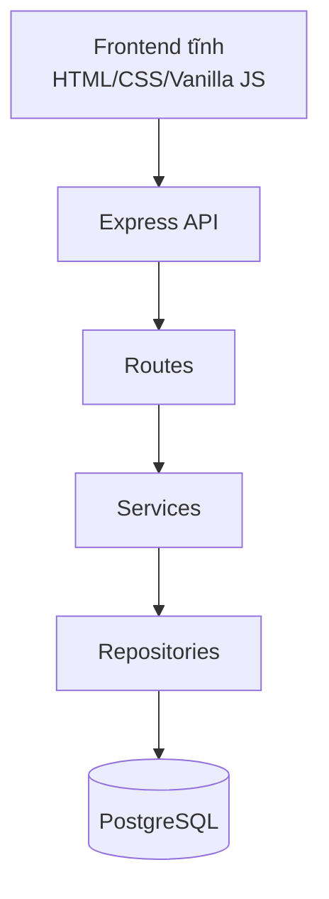

# MedBook - PROD/PRD demo

## 1. Mục tiêu

MedBook là ứng dụng demo đặt lịch khám bệnh cho bài học AI-assisted SDLC. Tài liệu này mô tả phạm vi sản phẩm vừa đủ để demo, giảng dạy và kiểm thử luồng nghiệp vụ chính.

Định hướng hiện tại:

- Làm một case nhỏ, rõ, chạy được bằng Docker.
- Công nghệ chính: Node.js, Express, PostgreSQL, frontend HTML/CSS/Vanilla JS.
- Chỉ có 2 vai trò nghiệp vụ: `patient` và `staff`.
- Có màn hình đăng nhập demo trước khi vào app.
- Không cần JWT thật, bcrypt, OAuth, SMS/email/payment hay kết nối hệ thống bệnh viện bên ngoài.
- Frontend cần đẹp, dễ dùng, tiếng Việt đầy đủ, nhưng không làm nghiệp vụ quá phức tạp.
- Tập trung vào tìm bác sĩ, xem slot, đặt/hủy lịch, staff quản lý slot và xác nhận/hủy lịch.

Đây không phải tài liệu production deployment. CI/CD được tách sang [cicd.md](./cicd.md).

Tài liệu kỹ thuật chi tiết được tách riêng:

- [data-model.md](./data-model.md) - ERD, từ điển dữ liệu, vòng đời trạng thái
- [backend-flows.md](./backend-flows.md) - sơ đồ tuần tự các luồng xử lý
- [adr/](./adr/) - lý do đằng sau từng quyết định thiết kế

## 2. Bối cảnh case

Bệnh viện dùng MedBook để quản lý lịch khám theo bác sĩ và khung giờ. Bệnh nhân tìm bác sĩ theo tên hoặc chuyên khoa, xem slot còn trống, đặt lịch khám trực tiếp hoặc online. Nhân viên bệnh viện điều phối lịch làm việc của bác sĩ, xem lịch hẹn theo ngày, xác nhận hoặc hủy lịch.

## 3. Phạm vi demo

### Trong phạm vi

- Đăng nhập demo bằng tài khoản seed sẵn.
- Metrics dashboard cho bệnh nhân và nhân viên.
- Bệnh nhân tìm kiếm bác sĩ theo tên, chuyên khoa.
- Bệnh nhân xem lịch làm việc và slot còn trống của bác sĩ.
- Bệnh nhân đặt lịch khám trực tiếp hoặc online.
- Bệnh nhân hủy lịch hẹn của mình.
- Nhân viên quản lý lịch làm việc: thêm slot, điều chỉnh trạng thái slot.
- Nhân viên xem danh sách lịch hẹn theo ngày.
- Nhân viên xác nhận hoặc hủy lịch hẹn.

### Ngoài phạm vi

- JWT thật, refresh token, password reset, tự đăng ký tài khoản.
- Các module ngoài danh sách tính năng pre-built của case study.
- Payment, bảo hiểm, hồ sơ bệnh án điện tử.
- Đồng bộ calendar ngoài.
- Multi-tenant, audit log pháp lý, phân quyền phức tạp.
- Thuật toán tối ưu lịch nâng cao.
- Production observability phức tạp.

## 4. Vai trò người dùng

| Vai trò | Mục tiêu | Quyền chính |
| --- | --- | --- |
| `patient` | Tìm bác sĩ và đặt lịch khám phù hợp | Xem bác sĩ/slot, đặt lịch, hủy lịch của mình |
| `staff` | Điều phối lịch khám trong ngày | Xem toàn bộ lịch hẹn, xác nhận/hủy lịch, thêm và điều chỉnh slot |

## 5. Luồng demo chính

### Luồng 1 - Bệnh nhân đặt lịch

1. Bệnh nhân vào trang đăng nhập demo và đăng nhập bằng tài khoản seed sẵn.
2. Bệnh nhân lọc bác sĩ theo chuyên khoa hoặc tìm theo tên.
3. Bệnh nhân chọn một slot còn trống.
4. Bệnh nhân chọn hình thức khám `in_person` hoặc `online`.
5. Hệ thống tạo appointment với trạng thái `booked`.
6. Slot chuyển sang `booked`.
7. UI hiển thị lịch hẹn mới trong "Lịch của tôi".

### Luồng 2 - Bệnh nhân hủy lịch

1. Bệnh nhân mở "Lịch của tôi".
2. Bệnh nhân bấm hủy một lịch chưa bị hủy.
3. Appointment chuyển sang `cancelled`.
4. Slot liên quan chuyển lại `available`.

### Luồng 3 - Nhân viên xác nhận hoặc hủy lịch

1. Nhân viên đăng nhập bằng tài khoản seed sẵn.
2. Nhân viên mở lịch hẹn theo ngày.
3. Nhân viên xác nhận một lịch đang `booked` hoặc hủy lịch khi cần.
4. UI cập nhật badge trạng thái để bệnh nhân/staff dễ theo dõi.

### Luồng 4 - Nhân viên quản lý slot

1. Nhân viên chọn ngày làm việc.
2. Nhân viên xem danh sách slot của các bác sĩ trong ngày.
3. Nhân viên thêm slot mới cho bác sĩ.
4. Nhân viên điều chỉnh slot bằng cách mở lại slot hoặc đánh dấu slot bận.

## 6. Quy tắc nghiệp vụ

### Đặt lịch

- Chỉ đặt được slot có trạng thái `available`.
- Một slot chỉ có tối đa một appointment đang hoạt động.
- Khi đặt thành công, slot chuyển sang `booked`, appointment có trạng thái `booked`.
- Nếu slot đã được đặt, API trả lỗi `409`.

### Hủy lịch

- Chỉ hủy appointment chưa `cancelled`.
- Bệnh nhân chỉ được hủy lịch của chính mình.
- Staff được hủy lịch của bất kỳ bệnh nhân nào trong demo.
- Khi hủy, appointment chuyển sang `cancelled`, slot chuyển lại `available`.

### Xác nhận lịch

- Staff có thể đổi appointment từ `booked` sang `confirmed`.
- Không xác nhận appointment đã `cancelled`.

### Quản lý slot

- Staff có thể thêm slot cho bác sĩ với ngày, giờ bắt đầu và giờ kết thúc.
- Slot mới mặc định là `available`.
- Staff có thể đổi trạng thái slot giữa `available` và `booked` để mô phỏng điều chỉnh lịch làm việc.

## 7. Xác thực và phân quyền demo

Không dùng JWT thật trong phiên bản này.

Cách làm:

- Seed sẵn nhiều user demo cho 2 vai trò: bệnh nhân và nhân viên.
- Frontend có màn hình đăng nhập demo; sau khi đăng nhập lưu `currentUser` trong `localStorage`.
- Mọi request gửi header demo `X-Demo-User-Id`.
- Backend có middleware `demoAuth` đọc header, tra user seed trong database và gán `req.user`.
- Middleware `requireRole('staff')` hoặc `requireRole('patient')` minh họa RBAC, nhưng không verify token production.

Lưu ý ghi rõ trong README và UI: đây là auth demo, không dùng cho production.

## 8. Kiến trúc hệ thống

Nguyên tắc:

- Giữ kiến trúc phân lớp để dễ học: route nhận request/response, service xử lý nghiệp vụ, repository truy vấn database.
- Không dùng framework frontend nặng.
- Không tích hợp service ngoài.
- Docker Compose chỉ cần app + database.

## 9. Data model tối thiểu

| Bảng | Mục đích | Cột chính |
| --- | --- | --- |
| `users` | User demo và vai trò | `id`, `name`, `email`, `demo_password`, `role`, `patient_id` |
| `patients` | Hồ sơ bệnh nhân demo | `id`, `name`, `phone` |
| `specializations` | Chuyên khoa | `id`, `name` |
| `doctors` | Bác sĩ | `id`, `name`, `title`, `room`, `specialization_id` |
| `slots` | Khung giờ khám | `id`, `doctor_id`, `date`, `start_time`, `end_time`, `status` |
| `appointments` | Lịch hẹn | `id`, `patient_id`, `slot_id`, `status`, `type`, `created_at` |

Slot lưu trực tiếp `doctor_id`, `date`, `start_time`, `end_time` là đủ cho case demo.

## 10. API contract

Tất cả endpoint dùng JSON và prefix `/api`.

### Demo auth

| Method | Path | Mô tả |
| --- | --- | --- |
| GET | `/api/demo-users` | Danh sách tài khoản demo |
| POST | `/api/demo-login` | Đăng nhập demo bằng email/password, trả về `{ user }`; không phát JWT |
| GET | `/api/me` | Trả về user hiện tại dựa trên demo header |

### Bác sĩ và slot

| Method | Path | Vai | Mô tả |
| --- | --- | --- | --- |
| GET | `/api/specializations` | patient, staff | Danh sách chuyên khoa |
| GET | `/api/doctors?specializationId=&q=` | patient, staff | Tìm bác sĩ |
| GET | `/api/doctors/:id/slots?date=` | patient, staff | Xem slot còn trống của bác sĩ |
| GET | `/api/slots/available` | patient, staff | Xem toàn bộ slot còn trống |
| GET | `/api/slots?date=` | staff | Xem slot để điều phối |
| POST | `/api/slots` | staff | Thêm slot mới |
| PUT | `/api/slots/:id` | staff | Điều chỉnh giờ hoặc trạng thái slot |

### Appointment

| Method | Path | Vai | Mô tả |
| --- | --- | --- | --- |
| POST | `/api/appointments` | patient | Đặt lịch với `{ slotId, type }` |
| GET | `/api/my-appointments` | patient | Xem lịch của bệnh nhân hiện tại |
| GET | `/api/appointments?date=` | staff | Staff xem lịch theo ngày |
| POST | `/api/appointments/:id/confirm` | staff | Xác nhận lịch |
| POST | `/api/appointments/:id/cancel` | patient, staff | Hủy lịch |

## 11. Frontend

Frontend là điểm cần làm chỉn chu để demo dễ hiểu.

### Nguyên tắc UI

- Màn hình đầu tiên là đăng nhập demo.
- Có danh sách tài khoản nhanh để chuyển giữa bệnh nhân và nhân viên khi demo.
- Có navigation rõ ràng theo vai trò.
- Ưu tiên layout sạch, bảng dễ scan, trạng thái bằng badge màu.
- Không nhồi quá nhiều chữ hướng dẫn trong UI.
- Vanilla JS là đủ cho case này.

### Màn hình bệnh nhân

- Metrics: số lịch của tôi, lịch chờ xác nhận, slot còn trống.
- Tìm bác sĩ: lọc chuyên khoa, tìm theo tên.
- Chi tiết bác sĩ: slot còn trống theo ngày.
- Đặt lịch: chọn hình thức `in_person` hoặc `online`.
- Lịch của tôi: xem trạng thái, hủy lịch.

### Màn hình nhân viên

- Metrics: lịch hẹn trong ngày, slot còn trống, số bác sĩ.
- Lịch theo ngày: lọc ngày, xem appointment.
- Hành động nhanh: xác nhận, hủy.
- Quản lý lịch làm việc: thêm slot mới, mở lại slot hoặc đánh dấu bận.

## 12. Seed data

Seed thật nằm trong `src/db/seed.js` và được chạy tự động khi app start. Dữ liệu seed hiện tại đủ cho demo trong 5 phút:

- 5 chuyên khoa: Tim mạch, Da liễu, Nhi khoa, Tai mũi họng, Cơ xương khớp.
- 6 bác sĩ.
- 5 bệnh nhân.
- 8 user demo: 5 bệnh nhân và 3 nhân viên.
- Slot trong hôm nay, ngày mai và vài ngày tới; seed tự cập nhật ngày tương đối mỗi lần app khởi động.
- Một vài appointment ở trạng thái `booked`, `confirmed`.

Tài khoản demo:

| Vai | Email gợi ý | Ghi chú |
| --- | --- | --- |
| patient | `an@medbook.local`, `linh@medbook.local`, `huy@medbook.local`, `nhi@medbook.local`, `nam@medbook.local` | Liên kết với bệnh nhân seed |
| staff | `mai.staff@medbook.local`, `khanh.staff@medbook.local`, `lan.staff@medbook.local` | Không liên kết hồ sơ bệnh nhân |

Mật khẩu demo cho mọi tài khoản là `demo123`.

## 13. Kiểm thử

Ưu tiên test ít nhưng đúng nghiệp vụ:

- Đặt slot available thành công.
- Không đặt được slot booked.
- Hai request đặt cùng slot đồng thời: đúng một cái thành công, một cái nhận 409.
- Hủy lịch trả slot về available.
- Staff xác nhận lịch booked thành confirmed.
- Staff thêm slot mới.
- Staff cập nhật trạng thái slot.
- Staff không mở lại được slot đang có lịch hẹn.
- Staff mở lại được slot sau khi lịch hẹn đã bị hủy.
- Demo auth chặn patient gọi endpoint staff.
- Demo auth chặn request thiếu `X-Demo-User-Id`.
- Đăng nhập sai mật khẩu bị từ chối.
- Không đăng nhập được nếu chỉ gửi `userId`.

Smoke test frontend:

- Đăng nhập tài khoản bệnh nhân, đặt lịch thành công.
- Đăng nhập tài khoản nhân viên, xác nhận lịch.
- Thêm slot mới và thấy bệnh nhân có thể chọn slot đó.

## 14. Error handling

| Tình huống | HTTP | Response gợi ý |
| --- | --- | --- |
| Thiếu dữ liệu bắt buộc | 400 | `{ "error": "Thiếu slotId" }` |
| Sai vai trò | 403 | `{ "error": "Không đủ quyền" }` |
| Không tìm thấy dữ liệu | 404 | `{ "error": "Không tìm thấy" }` |
| Slot đã được đặt | 409 | `{ "error": "Khung giờ đã được đặt" }` |
| Appointment đã hủy | 409 | `{ "error": "Lịch hẹn đã bị hủy" }` |
| Lỗi không lường trước | 500 | `{ "error": "Lỗi máy chủ" }` |

## 15. Definition of Done

Một bản demo được xem là đạt khi:

- Chạy được bằng `docker compose up`.
- Có dữ liệu seed để thao tác ngay.
- Patient đặt/hủy lịch được từ UI.
- Staff xác nhận/hủy lịch được từ UI.
- Staff thêm và điều chỉnh slot được từ UI.
- Metrics dashboard hiển thị đúng số liệu cơ bản.
- Không có tích hợp ngoài bắt buộc.
- README ghi rõ đây là demo, auth không phải production auth.
- Test nghiệp vụ chính pass.

## 16. Ghi chú cho workbook 5 ngày

Case này phù hợp với workbook MedBook 5 ngày:

- Day 1: phân tích SDLC và điểm mất context.
- Day 2: viết requirement/user story cho đặt lịch khám.
- Day 3: implement backend/frontend cho đặt lịch và quản lý slot.
- Day 4: review lỗi/rủi ro AI-generated code.
- Day 5: tổng kết workflow AI-assisted SDLC.

Điểm chỉnh lại so với bản cũ: không yêu cầu production-grade auth và không thêm chức năng ngoài khung pre-built. Mục tiêu là một case đủ thật để học SDLC, nhưng đủ nhỏ để hoàn thành trong workshop.
